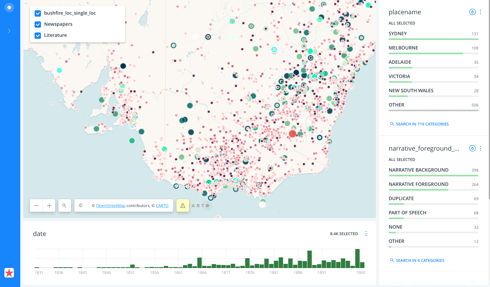

# Historical Fires Near Me 
## This repository contains code used to create the 'Historical Fires Near Me' Map.
### Zoom out when map loads to view Australian continent
## [Link to Map](https://finnoscarmorgan.github.io/Bushfire_Map/)

In November 2019 the official app of the NSW Rural Fire Service, “Fires Near Me,” became the fastest downloaded App on both Android and Apple platforms.  The app, designed to alert users to both proximity and severity of bush-fires, became the official prism through which the unfolding disaster was interpreted.  The map possessed an intensity that belied its simplistic rendering as users watched fires tick over from “watch and act” to “emergency” status in real time. Although temporally located, the severity of certain fires meant they became a static part of the interface. An uncanny habituation occurred for the user as event was rendered geography and fire became a recognisable and  immutable aspect of the landscape. 

At the same time as disaster unfolded, discussion and advocacy for immediate climate reform dominated public debate. Politicians, however, time again proclaimed the issue as “complex” and not without precedent. “Unprecedented” was certainly the defining word for this crisis. The Summer of 2019/2020 saw climate records break so consistently that the term quickly become semantically exhausted. “Historical Fires Near Me” engages with this terrain: both political and geographical.  Borrowing from the identifiable and culturally resonant imagery of the “Fires Near Me” app, this interface seeks to produce a cultural, literary and historical map of documented bushfires across the 19th and early 20th century.   This map collates newspaper records on documented fires and complements this with fictionalised writings on bush-fires produced over the same period and published in the same medium.

By attending to the paratextual elements that accompany these stories, this map explores the relationship between fictional representations of bushfires and their real-world referent. Ultimately, this map demonstrates that the cultural status of disaster is contingent on the political moment, recording how disaster is memorialised, mythologised and finally forgotten. “Historical Fires Near Me” not only demonstrates the culturally significant role that bushfires play in settler Australian national identity, but also acts as a comprehensive historical record that attests to the unprecedented crisis of the Summer of 2019/2020.

## [Link to Map Data]([https://www.tlcmap.org/view/timeline.html?load=https://www.tlcmap.org/ghap/publicdatasets/170/json?sort=start](https://tlcmap.org/layers/170))
